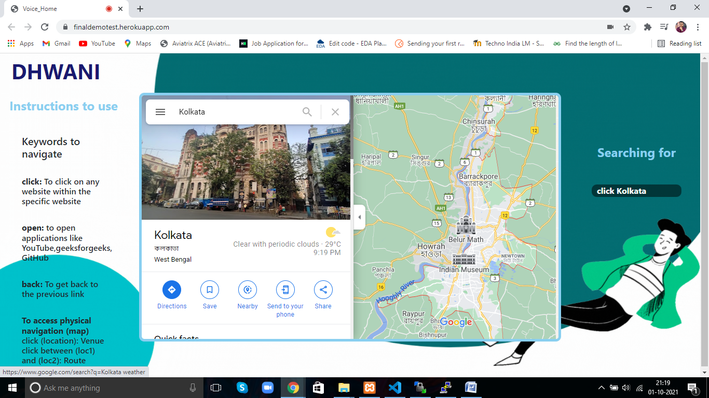
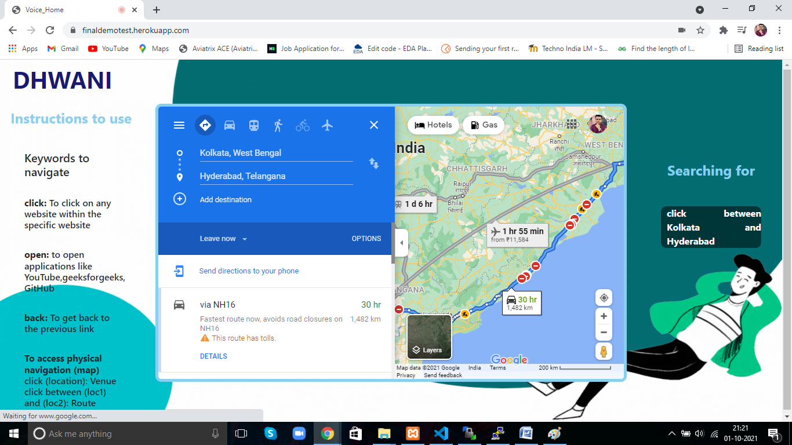
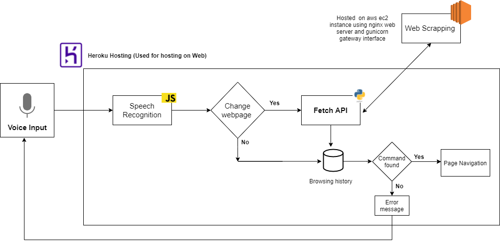

# Dhwani: Voice Command Driven Web Application

The application enables users to surf the internet totally handsfree using voice recognition technology. Users may visit the application from their browser and start surfing any webpage using voice commands. 

Try it out [Click here](https://finaldemotest.herokuapp.com/)

Refer to the documentation [Click here]()

## Pre-requisites

- [Google Chrome Browser](https://www.google.com/intl/en_in/chrome/)
- [Ignore X-Frame headers extension](https://chrome.google.com/webstore/detail/ignore-x-frame-headers/gleekbfjekiniecknbkamfmkohkpodhe/related)

## How to use

Hit the given [url](https://finaldemotest.herokuapp.com/) from Google Chrome browser. A prompt for accessing the microphone shall be displayed if prior permission is not allowed previously. Allow the browser to access the microphone. If the above mentioned extension is not enabled, one can install the [extension](https://chrome.google.com/webstore/detail/ignore-x-frame-headers/gleekbfjekiniecknbkamfmkohkpodhe/related) right from this page.

          

The user can speak into the console and the subsequent webpage shall be displayed. 
To open Youtube for example,you can use speak in any one of the following method

- Open Youtube
- www.youtube.com
- Youtube

While the first 2 will open [Youtube](https://www.youtube.com/) directly, the 3rd method will search for Youtube in Google. Now to access Youtube, you may use any one of the following keywords. Some examples are as

- Click History
- Click Subscriptions
- Back

          

The application also shows the Google map based location of a place as requested by the user and the route between 2 locations. This can be done using the following set of commands once the user has entered into Google maps using the command 

-open map

Then the user can find the location of "Kolkata" or the distance between "Kolkata and "New York" as follows

- click Kolkata
- click between Kolkata and New York

A demonstration video for the same has been shown below.

## Architecture

The above diagram describes the architecture of the project. The main application is hosted at [Heroku](https://finaldemotest.herokuapp.com/) and the Fetch API access the Flask based API hosted in [AWS EC2](http://52.66.204.194:8000/). The API returns link to the searched location based on a regular expression based web scrapping algorithm.

## Instructions to run

Download all the files and run the [home.html](home.html) file. Ensure php is enabled into the server.

## Rights

The project was developed under the guidance of Dr. Subhamita Mukherjee  and mentored by Mr. Soumyadeep Sen by

- Abhiroop Basak
- Soumyadeep Pal
- Akash Kumar
- Abhisekh kumar

