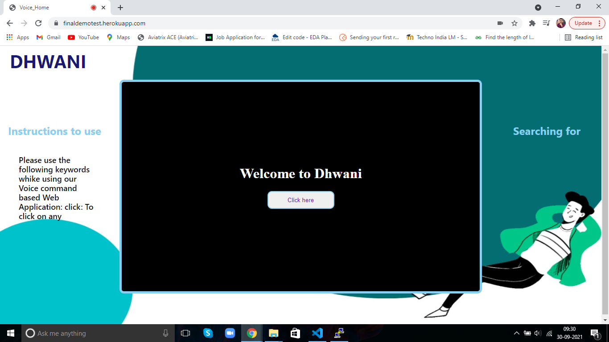
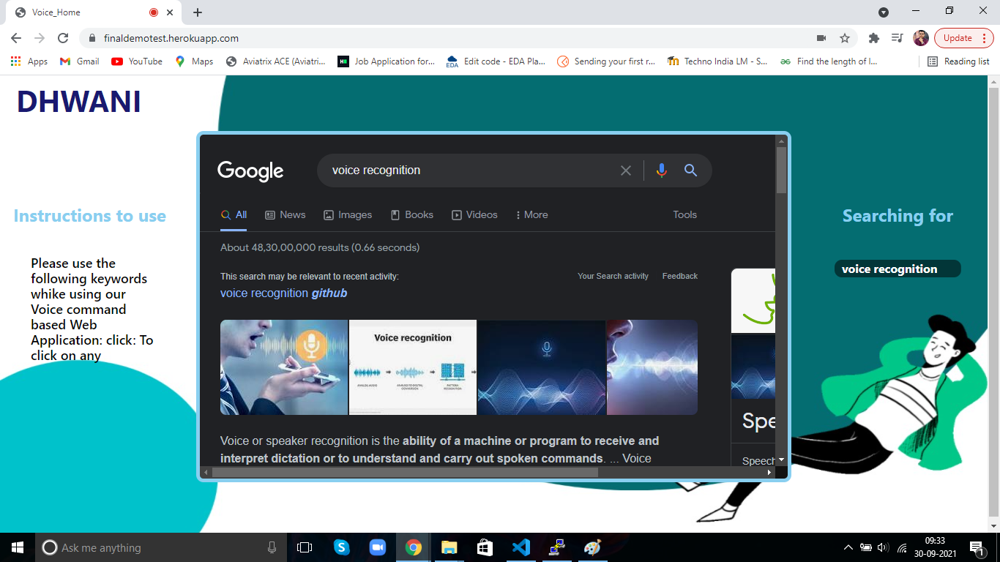

# Dhwani: Voice Command Driven Web Application

The application enables users to surf the internet totally handsfree using voice recognition technology. Users may visit the application from their browser and start surfing any webpage using voice commands. 

Try it out [here](https://finaldemotest.herokuapp.com/)

## Pre-requisites

- [Google Chrome Browser](https://www.google.com/intl/en_in/chrome/)
- [Ignore X-Frame headers extension](https://chrome.google.com/webstore/detail/ignore-x-frame-headers/gleekbfjekiniecknbkamfmkohkpodhe/related)

## How to use

Hit the given [url](https://finaldemotest.herokuapp.com/) from Google Chrome browser. A prompt for accessing the microphone shall be displayed if prior permission is not allowed previously. Allow the browser to access the microphone. If the above mentioned extension is not enabled, one can install the [extension](https://chrome.google.com/webstore/detail/ignore-x-frame-headers/gleekbfjekiniecknbkamfmkohkpodhe/related) right from this page.

          

The user can speak into the console and the subsequent webpage shall be displayed. 
To open Youtube for example,you can use speak in any one of the following method

- Open Youtube
- www.youtube.com
- Youtube

While the first 2 will open [Youtube](https://www.youtube.com/) directly, the 3rd method will search for Youtube in Google. Now to access Youtube, you may use any one of the following keywords. Some examples are as

- Click History
- Click Subscriptions
- Back

A demonstration video for the same has been shown below.

## Architecture

The above diagram 

